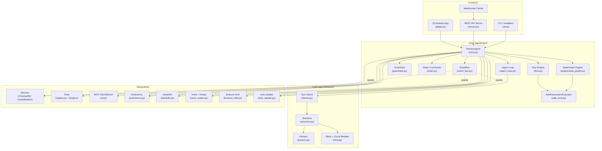
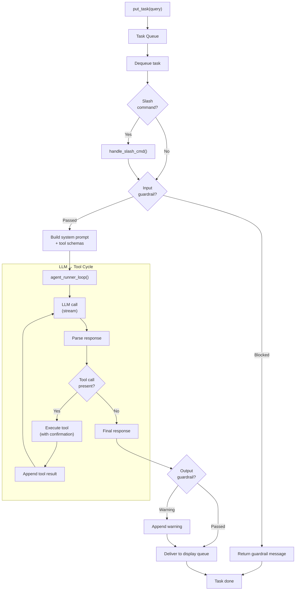
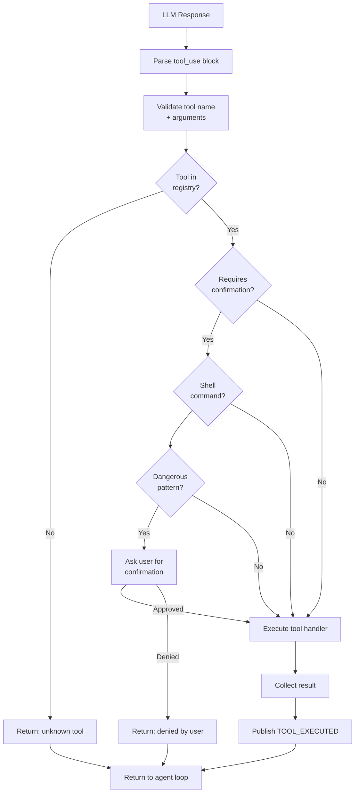
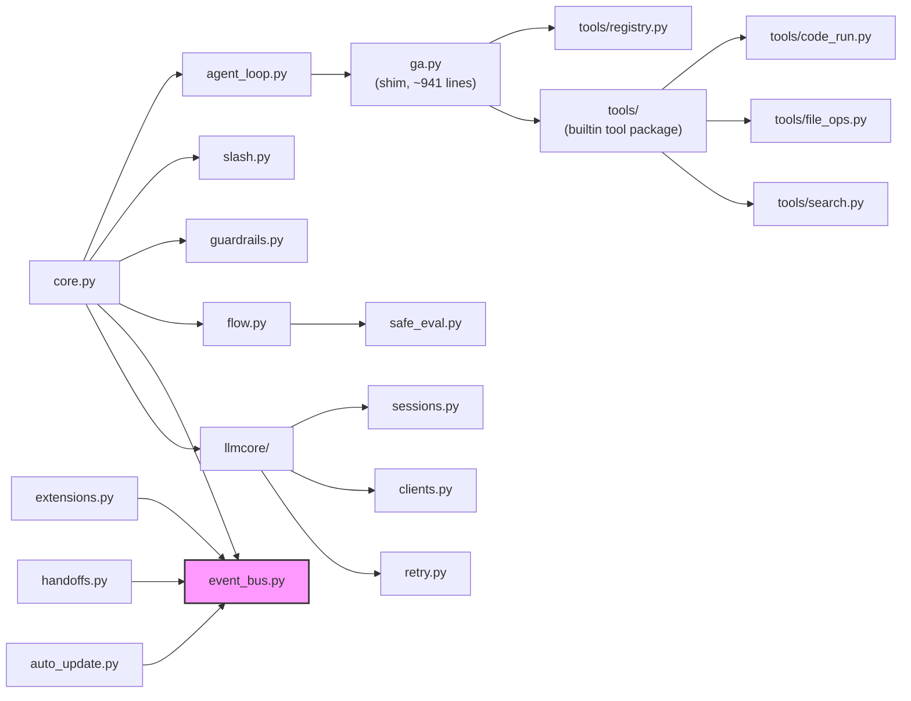
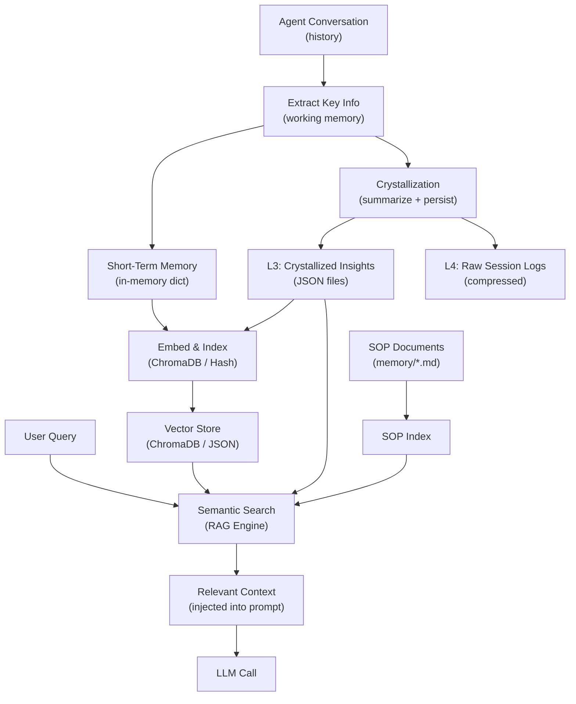
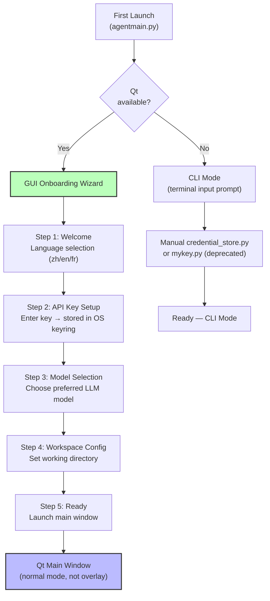

# GenericAgent v1.0.0 — Architecture

This document provides a visual overview of GenericAgent's architecture
using [Mermaid](https://mermaid.js.org/) diagrams.

---

## 1. Global Architecture

The system is divided into three layers: **Frontend**, **Core**, and
**Subsystems**.  The Core orchestrates LLM calls, tool dispatch, and
the agent loop.  Subsystems (Memory, Tools, MCP, etc.) are
lazy-initialised and communicate through the EventBus.



---

## 2. Agent Loop Flow

The main loop processes one task at a time from the task queue, running
the LLM + tool cycle until the task is complete or aborted.



---

## 3. Tool Dispatch Flow

When the LLM produces a tool call, the handler dispatches it through the
tool registry with security checks.



---

## 4. Security Layers

Security is applied at multiple layers, from network to code execution.

```mermaid
graph TB
    subgraph Layer1["Layer 1: Network"]
        HTTPS["Strict-Transport-Security"]
        CSP["Content-Security-Policy"]
        CORS["CORS (localhost only)"]
        RateLimit["Rate Limiting<br/>(30 req/min /chat)"]
    end

    subgraph Layer2["Layer 2: Authentication"]
        JWT["JWT / Bearer Token<br/>(~/.genericagent/auth_token)"]
        WSAUTH["WebSocket Token Validation"]
        OriginCheck["Origin Validation"]
    end

    subgraph Layer3["Layer 3: Input Validation"]
        Guardrails["Input Guardrails<br/>(guardrails.py)"]
        SlashAllowlist["Session Attr Allowlist<br/>(SESSION_WRITABLE_ATTRS)"]
        PathCheck["Path Traversal Prevention<br/>(os.path.realpath check)"]
        FileLimit["File Size Limit<br/>(10 MB)"]
    end

    subgraph Layer4["Layer 4: Code Execution"]
        SafeEval["SafeExpressionEvaluator<br/>(AST allowlist)"]
        NoEval["eval()/exec() Removed"]
        ShellConfirm["Shell Confirmation<br/>+ Dangerous Pattern Detection"]
        Keyring["API Keys in OS Keyring<br/>(not in source)"]
        PathTraversal["Path Traversal Prevention<br/>(workspace validation in code_run/file_ops)"]
    end

    subgraph Layer5["Layer 5: Data Protection"]
        LogRedact["Log Anonymization<br/>(API key redaction)"]
        EncryptedStore["Encrypted Credential Fallback<br/>(Fernet)"]
        SignedUpdates["Signed Auto-Updates<br/>(Ed25519 signature mandatory,<br/>fail-closed, not optional)"]
        ZipSlipFix["Zip Slip Prevention<br/>(path boundary check)"]
    end

    Layer1 --> Layer2 --> Layer3 --> Layer4 --> Layer5
```



---

## 5. Module Dependency Map

A simplified view of how the main modules depend on each other.  The
EventBus breaks cycles between the Core and Subsystems.



---

## 6. Memory Pipeline

Data flows from the agent's conversation through memory extraction,
vector embedding, and semantic search, with a crystallization step
that persists long-term insights.



---

## 7. Frontend-Backend Communication

The Qt frontend communicates with the agent backend through thread-safe
queues and signals.  The optional REST/WebSocket API provides remote
access.

```mermaid
sequenceDiagram
    participant User
    participant Qt as Qt Frontend<br/>(ChatPanel)
    participant SH as StreamHandler
    participant Agent as GenericAgent<br/>(core.py)
    participant Loop as Agent Loop<br/>(agent_loop.py)
    participant LLM as LLM Provider
    participant CB as Circuit Breaker
    participant EB as EventBus

    User->>Qt: Type message + Send
    Qt->>Agent: put_task(query)
    Agent-->>Qt: display_queue (Queue)

    Qt->>SH: start_stream(agent, prompt)
    Note over Qt,SH: poll_timer starts (50ms)

    Agent->>Loop: agent_runner_loop()
    Loop->>LLM: streaming API call
    LLM-->>Loop: text chunks + tool calls

    Loop-->>Agent: yield chunks
    Agent->>Agent: display_queue.put({"next": chunk})

    SH->>Agent: display_queue.get()
    Agent-->>SH: chunk dict
    SH->>Qt: _on_stream_chunk(text)
    Qt->>User: Update streaming row

    Loop-->>Agent: final response
    Agent->>Agent: display_queue.put({"done": full_text})

    SH->>Agent: display_queue.get()
    Agent-->>SH: {"done": full_text}
    SH->>Qt: _on_stream_done(final_text)
    Qt->>User: Display final message

    Note over CB,EB: Circuit Breaker state changes
    CB->>EB: state_changed event
    EB->>Qt: UI banner update (open/half-open/closed)

    Note over Qt,Agent: Also available via REST API:<br/>POST /chat → SSE stream<br/>WebSocket /ws/chat
```

---

## 8. Onboarding Wizard Flow

On first launch, if Qt is available, a GUI onboarding wizard replaces
the old terminal configuration menu.  The wizard guides new users
through essential setup and stores credentials securely in the OS
keyring.



> **Note:** On subsequent launches the wizard is skipped; the main
> window opens directly.  The `--overlay` flag can be used to switch
> from normal window mode to the developer overlay.
